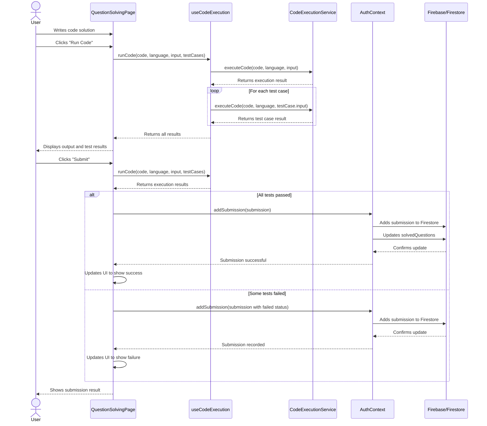
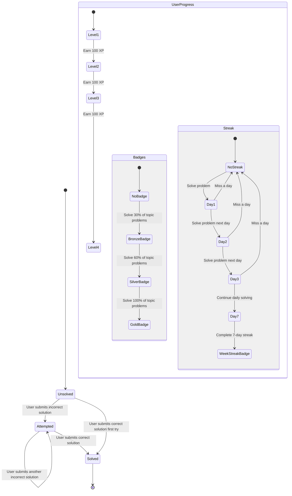
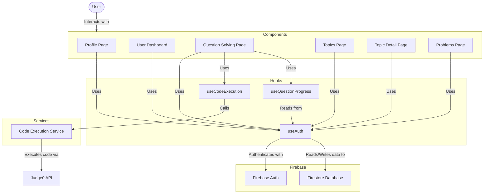

# User Progress Tracking System - UML Diagram

```mermaid
classDiagram
    class AuthContext {
        -currentUser: User
        -userProgress: UserProgress
        -loading: boolean
        -profileLoading: boolean
        +signIn(email, password): Promise~void~
        +signUp(email, password): Promise~void~
        +logout(): Promise~void~
        +updateUserProfile(profileData): Promise~void~
        +addSubmission(submission): Promise~void~
        +updateSolvedQuestion(questionId): Promise~void~
        -fetchUserProfile(userId): Promise~void~
        -fetchUserProgress(userId): Promise~void~
        -saveUserProgress(progress): Promise~void~
    }

    class UserProgress {
        +userId: string
        +displayName: string
        +solvedQuestions: string[] | Record~string, boolean~
        +submissions: Submission[]
        +streak: Streak
        +categoryProgress: CategoryProgress[]
        +difficultyProgress: DifficultyProgress[]
        +topicProgress: TopicProgress[]
        +badges: Badge[]
        +totalSolved: number
        +totalAttempted: number
        +rank: number
        +xp: number
        +level: number
    }

    class Submission {
        +id: string
        +userId: string
        +questionId: string
        +questionTitle: string
        +code: string
        +language: string
        +status: string
        +timestamp: Date
        +executionTime: number
        +memory: number
        +runtime: number
    }

    class CodeQuestion {
        +id: string
        +title: string
        +difficulty: string
        +language: string
        +languageId: number
        +tags: string[]
        +description: string
        +starterCode: Record~string, string~
        +testCases: TestCase[]
    }

    class TestCase {
        +input: string
        +expectedOutput: string
        +actualOutput: string
        +passed: boolean
        +executionTime: number
    }

    class CodeExecutionService {
        +executeCode(code, language, input): Promise~SubmissionResult~
    }

    class useCodeExecution {
        -isRunning: boolean
        -output: string
        -testResults: TestCase[]
        +runCode(code, language, input, testCases): Promise~ExecutionResult~
    }

    class useQuestionProgress {
        -progress: {status, lastSubmission, submissionCount}
        +getProgress(): {status, lastSubmission, submissionCount}
    }

    class QuestionSolvingPage {
        -question: CodeQuestion
        -code: string
        -selectedLanguage: string
        -customInput: string
        -output: string
        -testResults: TestCase[]
        -lastSubmissionStatus: string
        +handleRunCode(): void
        +handleSubmitCode(): void
        +handleResetCode(): void
    }

    class UserDashboard {
        -activeTab: string
        -difficultyFilter: string
        -searchQuery: string
        -filteredSubmissions: Submission[]
        -stats: {totalSolved, totalSubmissions, acceptanceRate, streak, xp, level}
        +setActiveTab(tab): void
        +setDifficultyFilter(filter): void
        +setSearchQuery(query): void
    }

    class Profile {
        -isEditing: boolean
        -displayName: string
        -bio: string
        -activeTab: string
        +handleSave(): Promise~void~
        +handleCancel(): void
        +updateUserProfile(): Promise~void~
    }

    AuthContext --> UserProgress : manages
    AuthContext --> Submission : creates
    UserProgress "1" *-- "many" Submission : contains
    UserProgress "1" *-- "many" Badge : earns
    UserProgress "1" *-- "1" Streak : tracks
    UserProgress "1" *-- "many" CategoryProgress : monitors
    UserProgress "1" *-- "many" DifficultyProgress : monitors
    UserProgress "1" *-- "many" TopicProgress : monitors
    
    QuestionSolvingPage --> useCodeExecution : uses
    QuestionSolvingPage --> AuthContext : uses
    QuestionSolvingPage --> CodeQuestion : displays
    QuestionSolvingPage --> TestCase : runs
    
    useCodeExecution --> CodeExecutionService : calls
    useQuestionProgress --> AuthContext : reads from
    
    UserDashboard --> AuthContext : reads from
    UserDashboard --> Submission : displays
    
    Profile --> AuthContext : updates
```

## Sequence Diagram for Code Submission Flow



## State Diagram for User Progress



## Component Interaction Diagram

